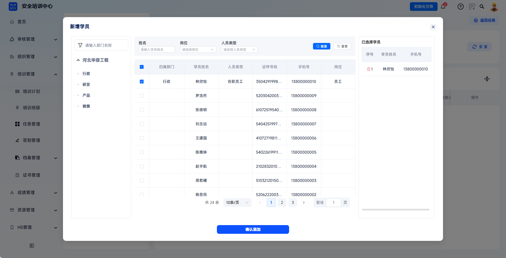
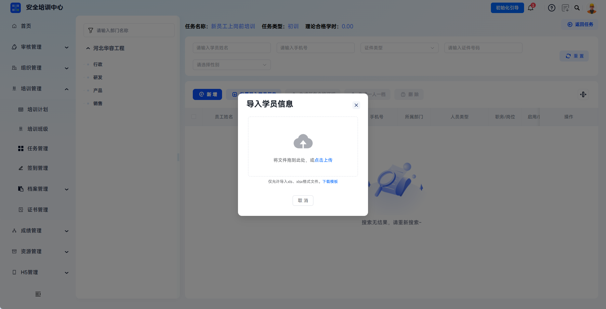
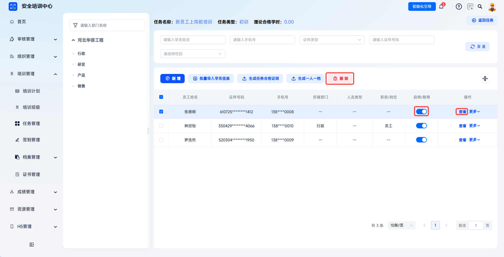

# Learner Import

The platform supports adding learners through single additions and batch import, enabling precise binding between training tasks and participants. Administrators can quickly filter target personnel by department structure and add them to tasks for subsequent training execution.

This document is typically used in the following scenarios:

- Adding participating learners after a training task has been created and released;
- Filtering by department, position, or personnel information and adding learners one by one;
- Importing task learners in batches through a template;
- Enabling or disabling learner participation in the current training task;
- Generating training certificates or personal archives for learners within the task.

 
 

## Workflow

### Enter Learner Management

In **Training Management** - **Task Management**, find the target task and click **More** - **Learner Management** for the task to enter the task learner management page.

The top of the page displays key information for the current task, including task name, task type, required theory study hours, and more. The left side is the department structure tree, which supports filtering learner sources by organization structure.

 

### Add A Single Learner

Click **Add** to open the learner selection dialog. Select target personnel (multiple selection is supported). The selected learner list is displayed on the right side of the dialog. After confirming that it is correct, click **Confirm** to complete the addition.

 

### Import Learners In Batches

Click **Batch Import Learner Information**, then click **Download Template** to download the Excel template provided by the system. Fill it in as required and upload it. After system validation succeeds, click **Confirm Import** to complete batch learner addition.

 

### View And Manage Learners

The learner list displays employee name, gender, document type, document number, mobile number, department, personnel type, job position, enabled status, and other information. Administrators can search and filter by learner name, mobile number, document type, document number, gender, and other fields.

| Action | Description |
| --- | --- |
| View | Preview detailed learner archive. |
| Delete | Remove the learner from the task. Only the association is deleted, not the personnel archive. |
| Enable / Disable | Control whether the learner participates in this training task. After disabling, the task is no longer displayed on the learner H5 side. |

---

### Generate Training Archives

After learners are added, task qualification certificates, one-person-one-archive files, course study-hour certificates, and course exam certificates can continue to be generated on the same page.

Click **Generate One Person, One Archive** to export the learner's personal training archive PDF.

---

Click **More** - **Course Certificate** to generate course study-hour certificates and course exam certificates.

| Certificate Type | Description |
| --- | --- |
| Generate Task Qualification Certificate | Generate training qualification certificates in batches for qualified learners. |
| Generate One Person, One Archive | Export learner personal training archive PDF. |
| Course Certificate | Generate course study-hour certificates and course exam certificates. |

 
 

## FAQ

**Q: Why can't some learners be found in the add list?**

A: Check whether the person has been archived under **Organization Management - Employee Management**, whether the person has already been added to the task, and whether the current account has view permission for the department.

---

**Q: How should I handle "duplicate document number" during batch import?**

A: It means the document number already exists in the task, or duplicate records exist in the spreadsheet. Check whether the learner has already been added and whether the document number conflicts with other personnel.

---

**Q: Can a mistakenly deleted learner be restored? Can the learner continue learning?**

A: Deletion only removes the task association and does not delete the learner's own information. After being added again, the learner can continue learning normally.

---

**Q: What is the difference between disabling and deleting a learner?**

A: A disabled learner cannot use the learner H5 side for learning, but personal information and learning history remain saved in the task and can be changed back to **Enabled** at any time. Deleting a learner removes the learner from this task.
