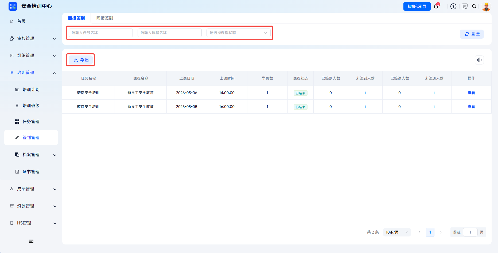

# Check-In Management

The platform supports unified management of learners' offline and online check-in records by task, enabling full-process digital traceability of training. Administrators can quickly view task-level check-in statistics, each learner's check-in days, and detailed check-in timelines, and can export check-in reports for internal audits and regulatory filing.

> Article 15 of the Measures for the Administration of Safety Production Training requires safety training archives to be established, truthfully recording training time, content, participants, assessment results, and other information. Through check-in management, the platform ensures training attendance is traceable and supported by visual evidence.

This document is typically used in the following scenarios:

- Viewing offline or online check-in records;
- Viewing task check-in statistics;
- Viewing learner check-in and check-out status;
- Exporting check-in reports or handling supplementary check-ins.

 
 

## Workflow

### Enter Check-In Management

Click **Training Management** - **Check-In Management**. The **Offline Check-In** tab opens by default. The system provides two dimensions, **Offline Check-In** and **Online Check-In**. Click the tabs to switch views.

 

### View The Check-In Data List

The list displays task information for all tasks that contain offline courses. You can filter target tasks by task name, task type, and task status. Click **Export** to export task check-in statistics reports for the current list in batches.

| Field | Description |
| --- | --- |
| Task Name | Training task name. |
| Task Type | Initial training, retraining, certificate renewal, and more. |
| Learners | Total number of participating learners under the task. |
| Task Start Time / Task End Time | Training period. |
| Today's Check-Ins | Number of learners who completed check-in today. |
| Task Status | Learning in progress, completed, and more. |

 

### View Task Check-In Details

Click **View** in the action column of the target task to enter the **Check-In Details** page. The page displays check-in summary data for all learners under the task and supports filtering learners by name, check-in status, and check-out status.

| Field | Description |
| --- | --- |
| Name | Learner name. |
| Task Name | Training task to which the current check-in record belongs. |
| Total Task Days | Number of days that require check-in within the task. |
| Department | Learner's department. |
| Check-In / Check-Out Time | Most recent check-in and check-out time. |
| Check-In / Check-Out Status | Displays the learner's current check-in and check-out results. |

Target learners can be selected for batch check-in or check-out operations.

 
 

## FAQ

**Q: How do I make up a missing check-in if a learner has an absence record?**

A: The system supports administrator supplementary check-in for learners on the **Check-In Details** page. Click **View** in the action column for the target task and target learner, then select a date for supplementary check-in.

---

**Q: Can check-in data be used as evidence for law enforcement inspection?**

A: Yes. Platform check-in data includes tamper-resistant records such as check-in timestamps and face recognition photos, meeting authenticity requirements for training archives. It is recommended to export backups regularly and keep them for at least 3 years.
